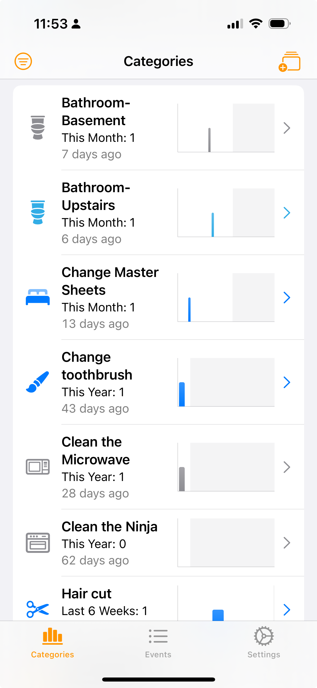
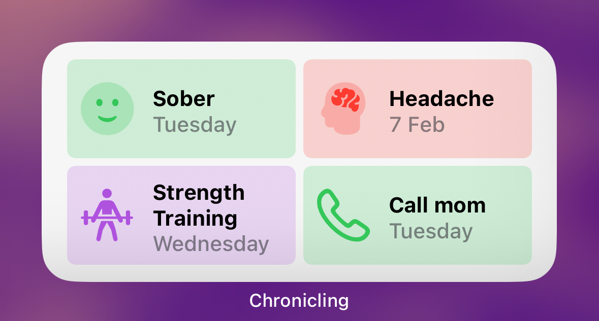
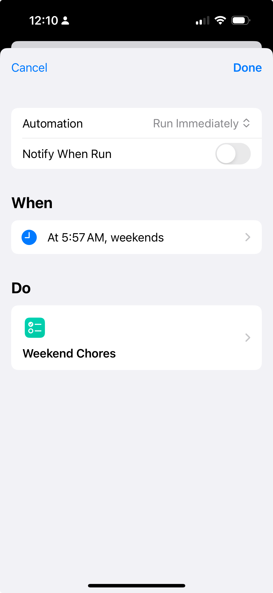
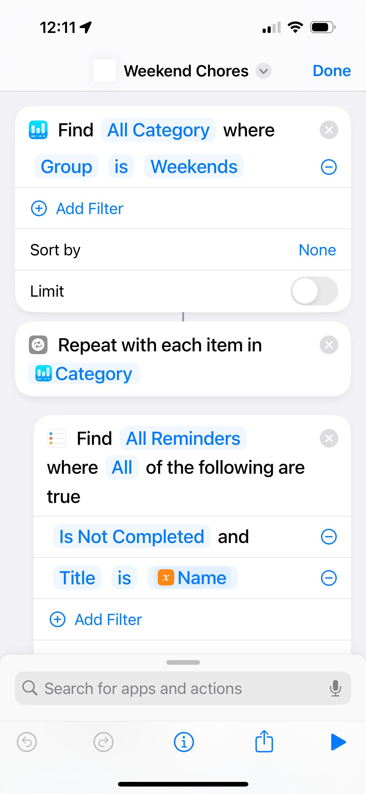

+++
date = '2024-02-17T11:49:05.810228-05:00'
draft = false
title = 'Automating my Household Chore Reminders'
+++

Living in a house, or even an apartment or condo, as an adult, requires periodic maintenance tasks, like cleaning the bathroom, changing your sheets, replacing the furnace filter, etc. A lot of these tasks should ideally be done on a regular schedule, like changing your sheets every two weeks, or your furnace filter every 3 months for example. I’m sure a lot of people just kind of mentally keep track of this kind of stuff, but I’ve never really trusted my own memory on it. And I don’t like the idea of a room being dirty serving as my reminder to clean it. I’d ideally like to clean it before it gets too dirty.

So to keep up-to-date on my household tasks, I need a way to help me with of the following:
1. How many days has it been since I did that task?
2. A reminder to do that task if it’s past the time it needs to be done.

Number 2 is the easy part, to some extent. That’s just a to-do list app, which for me is Reminders, the built-in to-do list app that comes with iOS and MacOS. Creating a task and making it due today is straightforward. Once it’s on my to-do list for the day, I’m pretty good at going through the stuff I need to do by checking the list. But how do I get things onto that list? I don’t want to do this manually, like some sort of animal.

Ideally, for regularly scheduled things, you could make a recurring task that repeats upon completion. So if I change the furnace filter and mark it as complete, I’d automatically get a task set 90 days from today to change the furnace filter. Unfortunately, Reminders doesn’t support recurring tasks after completion, just recurring tasks on a regular schedule (every 2 weeks, every day, etc.) And in any case, I prefer to do a lot of my household chores on the weekend, and either method often results in tasks popping up on a weekday, where I’m not really in a position to do it.

Number 1, tracking how many days it’s been, is also tricky with Reminders or most to-do list apps. Sure, you can usually check a list of completed tasks to see when you last changed the furnace filter, but it usually involves some scrolling or searching to get you there. And ideally I just want to see an easy number, like “It has been 45 days since you changed your furnace filter” so I can check at a glance when I last did it.

## My Solution: Chronicling and Shortcuts
I should preface my solution to this challenge with a couple of caveats:
- This solution is fairly complicated to set up and is probably not for everyone.
- I probably put more effort into this solution than is really warranted vs. just going with something more straightforward.

That said, I get a ton of satisfaction from solving and refining little challenges like this, so even if the result may be overkill, the fun I had putting all this together has been well worth the investment. So with that, let’s jump into how this works!

The first ingredient in my solve for this was an app called [Chronicling](https://apps.apple.com/ca/app/chronicling-track-anything/id6445992145), by Rebecca Owens. Chronicling is available for iOS and iPadOS (and technically for macOS as an iPad app) but I mainly use it on my iPhone. Chronicling lets you create any sort of category and then lets you log the last time you did that thing. You can customize each category with a colour and an icon, and then you can see at a glance when the last time you did that thing was, along with a few status and some nice graphs. Here’s an example from my setup of Chronicling:

There’s also a widget so you can see a select group of categories in your home screen and both see when the last time you logged them was, and let you quickly log them right on the widget by tapping their icon. Here’s how I set up mine:

Chronicling on its own is an app I highly recommend for anyone who wants to simply log things that are important in their life. But the big game-changer for me with Chronicling was its extensive support for Shortcuts, the built-in iOS automation app that is probably the iPhone’s best kept secret.

The app comes with a great suggestion to use Shortcuts to log when you go to places. I did that to track how often I’m going into my work’s office, a habit I’m trying to get better at. That involved a fairly simple automation that logs a visit to the office every time I visit that location on that day (well, I added a bit of logic to only log it once per day in case I go out for lunch or something.)

Where things really get complicated, but kind of awesome, is combining Shortcuts, Chronicling and Reminders to help remind me to do stuff when I need to do them.

So going back to my original challenge, I need (_okay, okay, “want”_) a way to remind me to do certain tasks if it’s time to do them, but only if it’s on a weekend. I did this by first grouping a series of categories in Chronicling to the “Weekend” group. Then, using Shortcuts, I have an automation that runs only on Saturdays and Sundays and checks every category in my “Weekend” group to see if it’s time to do them, and if so, create a task in Reminders that’s due today.

This means that I need to use Chronicling’s ‘notes’ feature to enter only a single number, which represents how many days I should be doing things. For things that I want to do every two weeks, I tend to under-count the number of days a bit and put 12, in case I ended up completing a weekend task on weekday and don’t want to push something out a whole other week if so.

I also use another automated Shortcut that runs every night to check my completed Reminders, and for any that match one of my categories, logs the event in Chronicling. Then, I only really need to worry about marking an item as complete in Reminders, and not having to also log it manually in Chronicling.

The Shortcut is also smart enough to first check if that task already exists before creating it. So if I had a task to change the sheets on Saturday, and I didn’t get to it, when the automation runs on Sunday, it will only create the “Change sheets” task if one doesn’t already exist and is not completed in Reminders.

I’ve also created a “Daily” category and corresponding automated Shortcuts for stuff that I could feasibly do on a weekday or weekend.

## Wrap Up
Again, I do very much get that this kind of solution isn’t for everyone, but I sure had a heck of a lot of fun making it (and continually tweaking and optimizing it.) If anyone would like to try this in their own, I’m including links to some of the Shortcuts I’ve created. These Shortcuts aren’t set up in a way that you can use them without configuration for your needs, but there should give you an idea of the logic so that you can build your own or tweak as you see fit. And if you really want to tackle doing this, and have any questions, or even any feedback on how I could make this setup better, please reach out!

### List of Shortcuts
1. [Create Weekend Chores](https://www.icloud.com/shortcuts/dc6d0149850542e090a0446b5bec54dd)
2. [Log Weekend Chores](https://www.icloud.com/shortcuts/68ee20fe41e845bd9d4941c01d0d7f3f)
