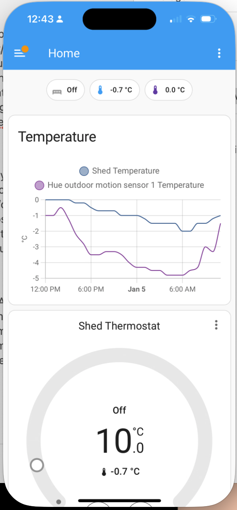

+++
date = '2025-01-05T12:46:35.609438-05:00'
draft = false
title = 'Home Assistant Virtual Thermostat'
+++

I recently insulated my shed so that I could work there throughout the year, with the aid of a space heater. Since I have an ethernet run to the shed and an Eero wifi router plugged into it to extend my network, I figured I could put the space heater on a smart plug so I could start heating it up to the desired temperature in the morning so it would be nice and toasty when I started work.

To measure the temperature, I got a Hue Motion Sensor, which doubles as a light and temperature sensor, and added both it and the smart plug to Homekit. I figured I could set up a Homekit automation to turn the space heater on at a certain time, then turn it off once it got to the desired temperature, then back on again when it dipped below the desired temperature. So essentially, I had hacked together a thermostat with this system.

The problem with doing a thermostat this way though is that it becomes a pain to set a different desired temperature at certain times. Homekit/Shortcuts automations let you set a trigger that kicks in when a temperature goes above or below a certain threshold. So I thought at first I could store the target temperate in Data Jar, which lets you store and retrieve information from iOS Shortcuts. But Shortcuts won’t let you use a variable for the target temperature in a trigger. So I’d have to make a Rube Goldberg-esque series of Shortcuts to trigger all at different times.

That’s when I turned to [Home Assistant](https://www.home-assistant.io), which I had recently set up but wasn’t using all that much. After some digging, I realized that you could add a ‘[generic thermostat](https://www.home-assistant.io/integrations/generic_thermostat/)’ to Home Assistant but specifying a heating/cooling source and a sensor. Once you do that, you just get a nice little thermostat that gives you controls to turn on heating or cooling as desired, and set a target temperature, and Home Assistant will take care of the logic of turning on and off your heating and cooling source as appropriate.

Best of all, you can actually use a plugin to push certain Home Assistant Devices into Homekit, including virtual thermostats. So my Home app now has a little Thermostat that I can control in the app or through automations. So I could make much simpler automations by just saying “at this time, set the temperature to this,” or “if motion detected, set the temperature to that.” 

Another nice bonus of using Home Assistant is that I can create a little dashboard for my Shed that includes the thermostat, the current temperature, as well as the outside temperature (I have a Hue Outdoor motion sensor as well) and lets my look at a little graph of temperature changes inside and outside. 

