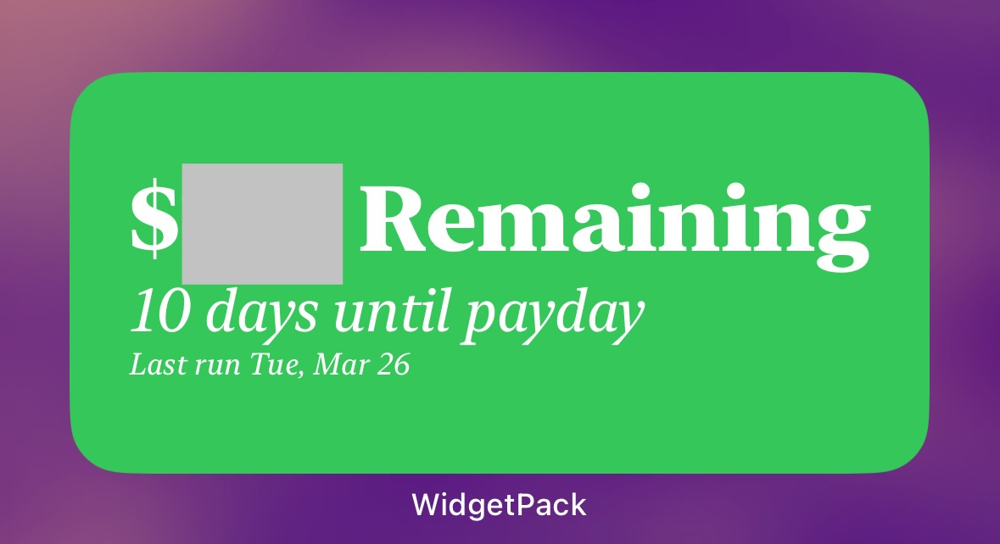

+++
date = '2024-03-24T20:37:53-05:00'
draft = false
title = 'How I Budget with Shortcuts on iOS'
+++

## Intro
I’ve managed my personal budgets in basically the same way since I started working a regular job, which, according to personal finance experts, is probably wrong but has always worked really well for me. I’ve recently figured out a fun way to automate my system using iOS Shortcuts and Reminders (and a couple of helper apps) and thought I’d share here both my budgeting system and the way I automate it.

Again, the way you are *supposed to* budget is not how I budget. What you’re supposed to do is to set aside budget amounts each month for different categories and spend within that amount. So you’d have a certain amount for “eating out” and a certain amount for “coffee” and “entertainment,” etc. And then if you’re low in one area, you can reallocate it to the other area so that your budget balances each month. I’ve tried that in the past, but I’ve always found it too fiddly to categorize all my expenses and keep track of it all. And it just feels weird to me to say “this is how much I want to spend on eating out this month” because what if there are a particular number of restaurant get-to-togethers that you’re invited to in a month that would put you over? And what if I don’t end up eating out a lot one month? Am I supposed to just ‘use up’ that budget?

Instead, I basically budget as if I live paycheque to paycheque. For every paycheque I get, a certain number of bills and deposits to savings and retirement accounts come out of it, and whatever is left is what I live on. The savings / retirement accounts are the flexible ones, so I generally just try to put as much as I can in those while still leaving enough in my checking account after bills to do ‘fun stuff.’ I do use credit cards to get the points, but I generally pay off my balance as soon as I see it reflected in my credit card account (not when I get the bill at the end of the month.) This way, I can keep my spending in “check” by just focusing on the amount remaining in my checking account after the bills and payments ‘assigned’ to that paycheque come out.

This has worked really well for me over the years, but calculating the amount remaining was always a little fiddly. Bills sometimes come out at different times, so I have to keep a running list of what hasn’t been paid and their sum so that I can deduct that amount from my checking account. For a long time, I kept a simple spreadsheet to track this. I’d have a list of all my withdrawals, when they come out, how much is in my checking, and the spreadsheet would calculate the amount remaining. I did this method of tracking for several years, and it was fine, but using spreadsheets on a phone generally sucks. Spreadsheets also aren’t great at letting you ‘check things off’ and build formulas around it.

## Enter Shortcuts + Reminders
I’ve long had the idea to make an iOS app to do my budget tracking, but my iOS developer skills are sub-par at best, and I didn’t think there’d really be enough interest to make it worth the effort. So this fall, I thought I’d try to tackle this using [iOS Shortcuts](https://support.apple.com/en-ca/guide/shortcuts/apdf22b0444c/ios). My thought was that if I could tell a Shortcut how much was left in my checking account, it could look at all the withdrawals that are coming up before my next pay day, and tell me how much I had left.
Shortcuts isn’t really great at working with spreadsheets, and I needed an easy way to check things off. So I turned to [Apple Reminders](https://support.apple.com/en-ca/102484). Reminders, of course, makes it straightforward to check things off to mark as complete on a phone. But it’s also a great solution because you can make your reminders repeat on a flexible schedule. This is really handy for tracking withdrawals, as some come out bi-weekly, and some are once a month. So then when I check a bill off, it will automatically re-appear as due the next month.
The other nice thing about Reminders is that Shortcuts works really well with Reminders. You can get a list of Reminders that fit certain criteria and then iterate on that list, mark them complete, etc. The simplest way I could think to set it up was to create a specific list called “Money” that it pulls from. I add each withdrawal to that list, each on its specific repeat schedule. Each with withdrawal starts with “$” followed by the amount, a dash, and the name of the bill. And I also add my paycheque to this list (without the amount) on its repeat schedule so that my Shortcut knows when I’m getting paid next. That way, the Shortcut can get a list of all my withdrawals that are happening *before* my next payday, and sum everything in that list (using some basic parsing to extract just the numbers from the reminders.) 
When I run the Shortcut, the first thing it does is ask me how much is *currently* in my checking account. I’d love to figure out how to get this number automatically somehow, but scraping data from a bank account is tricky by design, and I’m very wary of granting a service access to my banking information. So I just remember the number from my chequing account and enter it in when prompted. Once I do that, it will do the logic and summing described above and just tell me how much I have left in my checking account. It’s very mobile-friendly and quick!
There are a couple of other tweaks that I’ve added to the Shortcut. The first that I store both the current amount and the calculated remaining amount in [Data Jar](https://apps.apple.com/ca/app/data-jar/id1453273600), the excellent (and free!) app built for storing data for Shortcuts to use. The amount in chequing is so if I run the Shortcut again after checking off a bill reminder, the Shortcut will grab the checking amount and pre-populate it as a default when run once more. The calculated remaining amount is to use as my second tweak, a widget! 
I thought it would be handy to display the latest amount on a widget on my phone’s Home Screen, so I can check it easily later without having to run the shortcut again. For this, I used the handy app, [WidgetPack](https://apps.apple.com/ca/app/widgetpack/id1526805384). WidgetPack is an app that lets you build and update widgets using a Shortcut. So I have a separate Shortcut that is run after my primary one to get the amount remaining and display on the widget, along with the days until my next payday and the last time it was run. Here’s what the widget looks like:

(The grey box was added to cover my actual amount remaining, for privacy’s sake.) 
The nice thing with WidgetPack is that you can configure the widget to run a shortcut (via internal url) when you tap it, so if I want to update my amount remaining, I just have to tap on the widget to run it.
If you’d like to try something similar, I’ve shared the links to the two shortcuts I use below. These Shortcuts haven’t been configured to be super shareable, but should give you an idea of how to recreate something similar or make it your own. 

## List of Shortcuts
- [Amount Remaining Shortcut](https://www.icloud.com/shortcuts/1ce69a97a5d44e9a804c1ef6acc23ce5)
- [Remaining Widget](https://www.icloud.com/shortcuts/2aa5e179b10942cd866a1234e7dd2725) 

