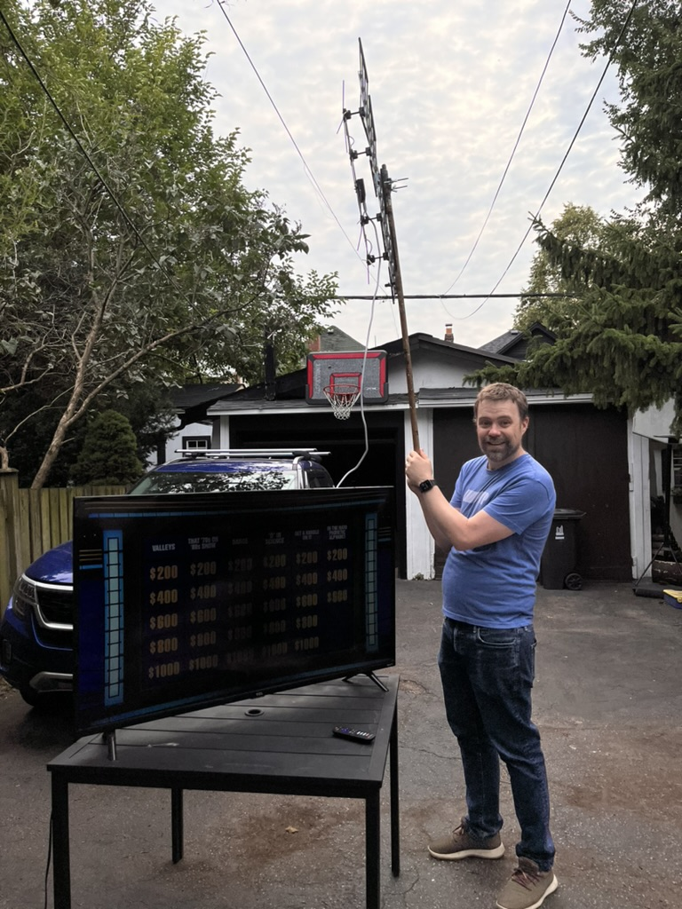
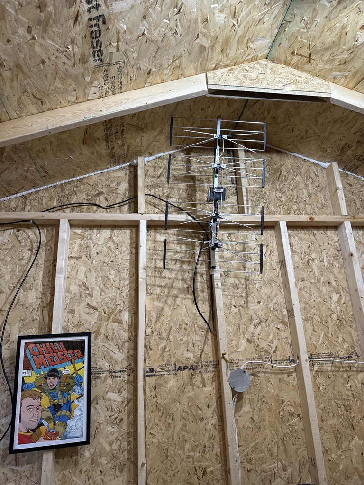

+++
date = '2024-03-09T20:37:53-05:00'
draft = false
title = 'How I Watch TV in 2024'
+++

## Intro
Like most people my age, I’ve been witness to a total transformation in how people watch TV over the course of my life. I’m actually old enough that the very first TV I watched was black and white, and over the air, with about 3–4 channels on a good day. Then at some point pretty early on, we got a colour TV and cable, opening up way more channels, and getting to see things like music videos and cartoons in full colour.

Then the cable companies introduced the electronic guide and a plethora of extra ‘digital’ channels, and finally the PVR. Each of these steps, for me, was pretty awesome — especially the PVR. The PVR finally let me easily record stuff I’d otherwise miss, skip commercials, and save up stuff to ‘binge.’ It was a total game changer for me, and I loved it. In many ways, it felt like a presage of what came next: streaming TV.

For me, streaming TV started with Netflix, and it was… pretty okay? Early Netflix in Canada had a few good things, but it was no replacement for cable. It got better over time, adding some great shows that were worth the monthly subscription on their own. And then more streaming apps came, opening up the options a lot more, as well as the cost.

Over time, my family and I ended up watching about 99% of stuff over streaming, but there were still some shows that weren’t really easily ‘streamable.’ Most notably, Saturday Night Live[^1], Jeopardy and live events like the Oscars, election coverage, etc.

So we kept paying a stupid amount for our cable subscription just for the privilege of watching a few things we couldn’t get elsewhere. But it was never lost on me that all of those shows and events I mentioned were still actually available over the air, the place I originally started watching TV. So I set out to solve this edge case with pure nerdery (and a bit of a capital investment) and finally put cable TV to bed forever.

## My Current TV Setup
### Step 1: The Antenna

It’s a well-kept secret that over-the-air TV got really good in the mid-2000s with the advent of digital broadcasting and HDTV. If you can get a clear signal, the quality of picture you get over the air is *great*. It’s actually a better signal than you’d get over cable because the cable companies have to compress the hell out of all of their signals to jam as many channels as they can through their wires. So I knew I wanted those signals, and my first challenge was getting and mounting an antenna.

You can get indoor antennas, which are *fine*, but everything I read said that it’s best to have a big-ass antenna outside, mounted as high as possible to get the most channels. I didn’t feel like going on my roof to install one, or paying someone to do the same. But we had recently built a big new shed in the backyard. I’d run electricity and ethernet to it, so I could work from the shed occasionally. So, maybe there was a way of installing the antenna there and piping the signals back to my house using ethernet? And then setting up some sort of computer with a hard drive to record stuff and let me play it back wherever I wanted? 

Before I got too far, I wanted to do a test to just see how many channels I could get with an antenna. So I bought a fair-sized antenna from kijiji[^2] for $20 and set it up outside and just hooked it up to my TV, holding the antenna up on a broom stick to get it as high as possible. I’m sure I looked like a total weirdo to my neighbours, but the experiment was a success. I actually got Jeopardy over the air!

Successfully completing this step gave me confidence to mount the antenna and further invest in the solution. I bought a proper [mounting arm](https://www.amazon.ca/gp/product/B08HVV46KR/ref=ppx_yo_dt_b_asin_title_o09_s00?ie=UTF8&th=1) for the antenna, and actually mounted it _inside_ my shed. This is because the mounting arm gave me several scary disclaimers about mounting too near electrical wires (electrical wires run right behind my shed) and about properly grounding it in case of lightning strike. So I tested again to see if I got decent signal inside my shed, and I did, so I mounted it there. It wasn’t pretty, but it’s a shed, so.

### Step 2: The PVR
My next step was figuring out how to solve 2 problems:

1. Watching the TV somewhere besides my shed
2. Recording stuff

Step 1 was solved with the use of a roughly $150 device called the “[HD Homerun](https://www.amazon.ca/gp/product/B092KM482V/ref=ppx_yo_dt_b_asin_title_o00_s00?ie=UTF8&psc=1 "HD Homerun").” Basically, this is a little box where you plug in a cable from an antenna and an ethernet cord connected to your network. Once that’s done, you can use their free app for your smartphone, streaming device, or through a web browser. The free software it comes with can record as well (if you pay a small subscription to get TV listings from a service.) The free software was… fine. And perfectly serviceable. But I just found it clunky, and I wanted better.

Enter, [Channels](https://getchannels.com), a very nice app that can read the signals from the Homerun and give you a pretty guide and also record stuff. Channels has a paid app for the Apple TV (my streaming device of choice) and shows you TV fed from the Homerun. But if you want to record stuff, you need to install their software on an always-on computer with enough storage to store your stuff. For that version, it’s a roughly $10/month subscription.

So I installed the Channels on an old Mac laptop with a 2TB hard drive attached to it to try it out. Within about ten minutes of using it, I immediately entered my credit card details because I liked it so much. Once it’s all set up, the computer just sits there doing its thing, and you *mainly* interact with it using one of their apps. You can scroll through the guide, and if you see a show you want to record, you can create a ‘pass’ to record and keep every episode. And you can even set it up so that you can watch TV, or your recorded stuff, anywhere there’s an internet connection. You can even download your recorded shows to your phone or tablet through their app, for the airplane or what have you.

### Solution Overview
So here’s a very simplified set-up of what I’ve got set up now.

Not shown here is the fact that any tablet, phone, or computer on my network can access stuff on Channels as well.

## Thoughts and Observations About My TV Setup

I’ve been running with this set-up for roughly six months now, and I am still just loving it so much. I canceled our cable subscription about a month after having it and have seldom regretted it. We can now watch Jeopardy or SNL in stunning quality whenever we want. And there’s a surprisingly lot of good stuff on broadcast TV! I’ve been watching cool documentaries from PBS and CBC and TVO. CTV will often air decent movies on Saturdays that I can record. And there’s a ton of old sitcoms I loved, like Cheers and Seinfeld, that I’m recording and building up a collection of. There’s so much good stuff I want to keep that I ended up getting a massive 16TB hard drive to add to my setup so I wouldn’t ever have to worry about running out of space.

And because Channels doesn’t have any deals with content creators or need to worry about weird licensing or other deals, they just build in features that are useful and helpful for their customers. 

## Awesome Things About Channels

### Commercial Detection and Skipping

After (and even in the middle of) recording a show, Channels can detect all the commercial breaks. Then, when you’re watching a show, instead of having to fast-forward through the breaks, you get a nice ‘skip commercials’ button that pops up that clicks you right past them. You can even make this automatic, so the commercials will always just skip.[^3] The commercial detection gets a little glitchy on live shows like SNL, but has generally been rock solid for me, and I love it so much. Skipping commercials is not something that cable companies would ever build into their PVR at the risk of alienating their broadcast partners.

### Watching Stuff Away from Home

My last cable provider actually had a half-decent app that let you watch stuff live, watch stuff you’ve recorded, and even let you download your recordings for offline viewing, with a few big asterisks. The asterisks are that each of those features being available depended entirely on the licensing deals they were able to put together. So if you were in another country, for instance, none of these features worked at all because their licensing was for Canada only. And not all channels were available to stream in the app. And even some of the stuff you recorded sometimes couldn’t be downloaded, depending on the licensing deals. I get while all these deals are in place, but as a consumer, it just stank.

Channels, because it’s just freely and legally letting you record stuff over the air, doesn’t care about any of that. As long as your Internet connection is good enough (and you’ve configured your network the right way) you can watch anything anywhere. You can download anything anywhere. They just give you, the viewer, maximum control over what you want to do with what you’ve recorded. It’s wonderful.

### Virtual Channels and Playlists

Virtual Channels are a fun feature of the Channels app that you configure based on content you’ve recorded that show up alongside regular channels. For instance, I have a virtual channel called “Sitcoms” that plays sitcoms that I’ve recorded, back to back, in a random order. The really neat thing is if you ‘tune in’ to a virtual channel, it starts playing based on when it was ‘scheduled.’ So you might end up seeing the last five minutes of something, or start five minutes in, just like watching TV in the old days. (There is a button to let you start from the beginning if you really want to.) I’ve found Virtual Channels are great channels for just throwing on something in the background while you’re cleaning or doing laundry or something and don’t really want to have to think about what you want to watch.

Channels also recently introduced “Playlists.” Just like music playlists, you can make your own custom playlists, say of movies or episodes of shows you like. You can even ‘shuffle’ the playlists to just play them in a random order. You can also set up playlists using “smart rules.” So I have a playlist that just shows everything I’ve recorded but not yet watched, in order from newest to latest. And another one of just stuff I’ve watched, so I can quickly go through and delete stuff I don’t want anymore. 

Virtual Channels and Playlists are such cool features that I’ve never seen anywhere else. I could see them being neat features of streaming apps. Imagine going to Netflix and making your own ‘channel’ of stuff you like from it, or a playlist of your favourite holiday episodes of different shows? I honestly think there is a real lack of imagination, or just some sort of weird reverence for ‘the algorithm’ that’s holding back streaming apps from implementing features like this. (Or, it’s very possible I’m just an edge case and these features wouldn’t actually be that popular.)

## Summing Up

So that’s my TV set up in 2024. I love this setup so much that I use it every day and that I’ve now written about 2000 words talking about. I do recognize that a lot of my enthusiasm for this comes down to pure nerdery, and most people probably don’t care enough to put this much money or effort into setting up something similar.

But when I really think about what I love about this setup so much, it’s the control and agency that I have. I can choose to get good quality video, not compressed to hell by the cable companies. I can mix and match and watch stuff I’ve recorded in several ways not possible through streaming apps or cable company PVRs. It just feels so cool to have so much agency and control over what I watch and how I watch it.

There’s a lot of talk about ‘cord cutters’ leaving cable because of high prices, or ‘subscription fatigue’ from people signing up to tons of streaming services. I wonder if the real root of this is just this annoying lack of agency that streaming services and cable companies put on how we watch stuff. My setup isn’t cheap or free, but I do not at all resent paying for it. I wonder if the content holders and app builders let people have a little more control and agency over how they watched stuff, if people wouldn’t feel so bummed out about how much they are paying for them? 

[^1]:	SNL requires a cable subscription to stream live and watching ‘on demand’ after strips out the musical guests and adds a bunch of un-skippable ads. Gross.
[^2]:	Side note: I fucking hate typing that site’s name. I had to google it and copy and paste it just to spell it correctly.
[^3]:	My dad’s favourite feature TVs added when I was a kid was the mute button. He LOVED hitting the mute button during commercials. If he were around today, I would really love to see his reaction to the commercial skip button. 