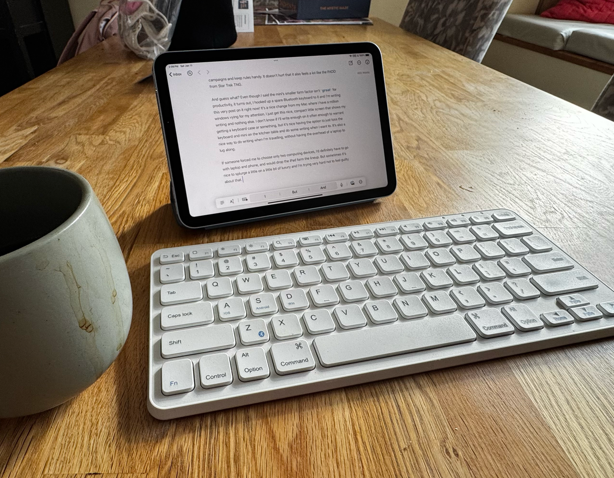

+++
date = '2025-01-11T14:22:43.471080-05:00'
draft = false
title = 'I Got an iPad mini'
+++

I’ve owned various iPads since about 2010. My last one was the 2018 iPad Pro 11” which I loved a ton during the before COVID times for taking to meetings and taking notes on. About a year ago my daughter really wanted an iPad and I wasn’t using it that much since remote work started in earnest, so I let her have it.

It’s been a year without an iPad and I gradually realized that I missed it a little bit. I do recognize that it’s a total luxury device. The combination of my phone and Mac is *fine* for most things and I can totally get by without an iPad. It’s just a nice little luxury for certain tasks.

The thing I missed most was an easy way to read the occasional comic book digitally. Reading comics on a phone sucks, as either it’s too small or you have to awkwardly zoom around. And reading on a computer just feels awkward. (And I don’t believe Marvel Unlimited, my favourite way to read comic books digitally, even works on a Mac. But I’m too lazy to check.)

I also missed it as a general reading device. I have a Kobo and read a lot of e-books on it and it’s great for that. But I read a lot of news sources, RSS feeds, and save stuff for later, and there’s something really nice about reading all that on an iPad.

I also found I missed the iPad for travelling, especially on the plane. The last couple of trips I loaded movies onto my phone and got a little stand for it, which, again, was perfectly *fine*. But I found I really missed having a slightly larger screen.

So when the iPad mini came out in late 2024, I pretty much knew I was going to get it. I’d had a mini before, and while it’s not really as good as productivity device, I love the smaller form factor for it being a little more book like and easier to hold with one hand. I also thought it would be a really handy way to quickly reference rules and characters and stuff during Star Trek Adventures on the [bespoke site](https://sta.tommertron.com/) I made for my crew to track campaigns and keep rules handy. It doesn’t hurt that it also feels a lot like the [PADD](https://en.m.wikipedia.org/wiki/LCARS#PADD) from Star Trek TNG.

And guess what? Even though I said the mini’s smaller form factor isn’t *great* for productivity, it turns out, I hooked up a spare Bluetooth keyboard to it and I’m writing this very post on it right now!

It’s a nice change from my Mac where I have a million windows vying for my attention. I just get this nice, compact little screen that shows my writing and nothing else. I don’t know if I’ll write on it often enough to warrant getting a keyboard case, but it’s nice having the option to just toss the keyboard and mini on the kitchen table and do some writing when I want to. It’s also a nice way to do writing when I’m travelling, without having the overhead of a laptop to lug along.

If someone forced me to choose only two computing devices, I’d definitely have to go with laptop and phone, and would drop the iPad form the lineup. But sometimes it’s nice to splurge a little on a little bit of luxury and I’m trying very hard not to feel guilty about that.