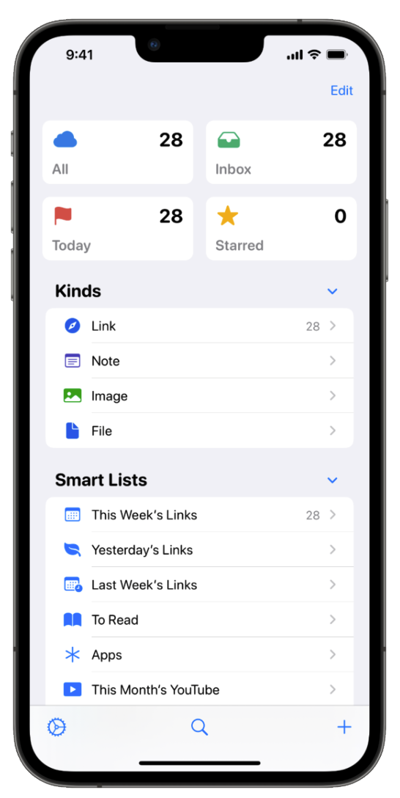
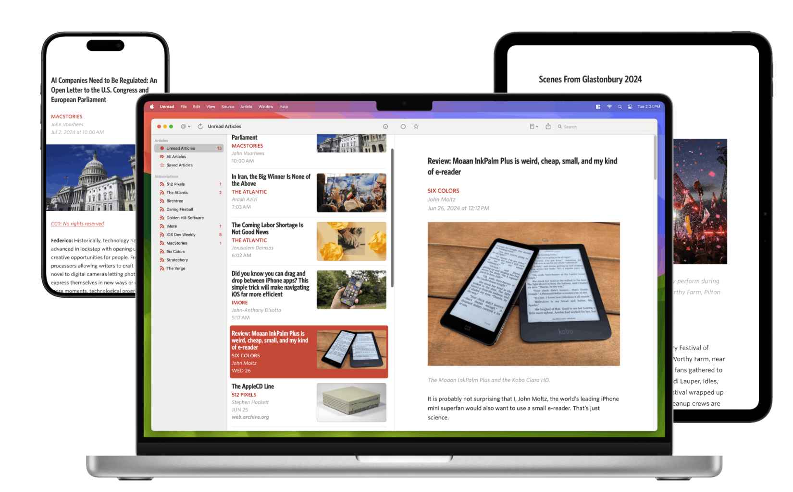

+++
date = '2025-01-03T17:32:09.669497-05:00'
draft = false
title = 'My Favourite Software of 2024'
+++

With another year complete, I thought I’d look back on my favourite software of 2024 and share here. Some of this is new software I tried, and some is software I’ve used a lot that I continue to use and love. Let’s dig in!

## Anybox

[Anybox](https://anybox.app) is a bookmark manager for iOS, Mac and iPad, that syncs all of your bookmarks, and lets you tag them, organize them into folders, and view them in different filterable, or ‘smart’ lists. For instance, you could have a smart list of articles tagged with “car” and added within the last year.

I’d used online bookmarking services before but ended up abandoning them after a while in favour of using my browser or various note-taking applications. But time and again, I kept not being able to find a link to something I’d stumbled across a while back and getting frustrated. Anybox solves that for me, as I’ve been defaulting to just adding any link that is remotely interesting or that I might come back to at some point, which Anybox makes straightforward through its Share Sheet integration on iOS.

Sometimes I will tag or organize the link on the spot, or sometimes just save it and organize the new links every week or so. Anybox makes this effortless by having built in “untagged” and “unorganized” (e.g. not in folders) lists so you can see everything that needs to be organized. I find I like to both tag and put a link in a folder, as well as adding a comment to increase the chances that I might find it again later. More often than not, though, I end up just defaulting to the “all” list which shows every link from the most recently saved on down. I’ll often also flag links that I’m frequently accessing.

I really went all in on Anybox this year, and it’s been one of my most consistently used apps all year. 

## Unread
I’ve used RSS to follow my favourite sites since at least 2006, a habit which survived even the death of Google Reader back in the day. It’s one of my favourite ways to keep up with smaller sites that don’t update very frequently so I can make sure not to miss anything. Best of all, with RSS, there is no algorithm deciding what I see. I choose exactly the sites that I want to see, no more and no less.

The other thing I like a lot about RSS is that because it’s an open standard, and your subscriptions are relatively portable, there’s a ton of different applications that have their takes on how to display and interact with the feeds you subscribe to.

I bounced around a lot of RSS apps this year, partly just out of curiosity, and I ended up landing back to [Unread](https://www.goldenhillsoftware.com/unread/) which I used years ago. The two things that got me with Unread are that its design and typography are among the best of any RSS reader out there in my opinion. And second, it has native integrations with the aforementioned Anybox as well as GoodLinks, which is an app I use to save longer articles to read later. So with one tap, I can send an article to one of those services.

The only little nitpick I have with Unread is that I wish it were a little easier to flip through articles without reading the whole thing. But it’s a pretty minor complaint, and doesn’t outweigh all the other good stuff about it.

Like Anybox, Unread has iOS, iPad and Mac applications, and uses iCloud to sync to all of your devices.

## GitHub Desktop for Mac
When I rebuilt my site this year using Hugo, I made GitHub central to the publishing workflow. This meant that I did countless git commits, as well as pushing and pulling to and from GitHub. I’m okay in the terminal, but I don’t have a lot of the git commands committed to memory. So the [GitHub Desktop](https://desktop.github.com/download/) app for Mac is such a nice little quality of life improvement for me.

It will tell me if my saved files are not committed, let me discard or ignore any files I want to, and tell me when my local repository is out of date from the GitHub repository, and let me pull the latest version from GitHub. It also lets me, with one button, open my entire repository in by editor of choice (BBEdit) where I can easily edit.

## ChatGPT
This isn’t exactly an obscure pick, but it’s pretty remarkable how much I’ve come to rely on ChatGPT this year. I find it’s often the quickest way to get a straightforward answer to something (even though I double-check important stuff) as well as coming up with coding help to text processing in general. 

ChatGPT was invaluable for me as I rebuilt this site and learned Hugo, helping me troubleshoot when things weren’t working, as well as creating little helper scripts that could process my files for posting, and helping me clean up my git repositories along the way.

I also (nerd alert!) got into the [Star Trek Adventures](https://modiphius.net/collections/star-trek-adventures?srsltid=AfmBOoqn9ZAR_-eXFpKxDrVutWOFSUVz5qyB8ZHy_zN82gkddL21ESnf) roleplaying game this year, and it was also super helpful there, coming up with quick character profiles, ideas for campaigns, campaign summaries (based on very loose notes) and images. I even upped some of my later campaigns by getting ChatGPT to build me some interactive web applications for my campaigns, letting my players try to decode corrupted log entries and keep track of temporal disruption during the game.

## Forklift
Either through my site rebuild or managing my media collection on my home server, I end up managing a **lot** of files both locally on my Mac and on other computers. Mac’s Finder is perfectly serviceable, but I kept getting annoyed that I had to open two windows to move files between folders, and found it a pain to easily access my favourite sub folders.

[Forklift](https://binarynights.com) was something I sought to try to fix those little annoyances. It’s a full-fledged Finder replacement for Mac, and by default, it always shows you two side-by-side panes with different folders. So dragging files between folders is always as easy as just dragging left-to-right or right-to-left between the two panes. There’s also a handy sync button that will let you completely sync two folders.

It also lets you easily store your favourite folders, and can even store and connect to remote servers using SSH. It’s by no means an essential application, but like GitHub Desktop, it’s such a nice little quality of life improvement.

## Wrap Up
I use a *lot* of different software, and the above is just scratching the surface, but just what came to mind as I wrote this. If anything, there’s probably a lot of recency bias in that list as well.

I’m going to do a better job of writing more consistently here in 2025, and I’ll definitely be sharing some more of my favourite software as the year progresses. 