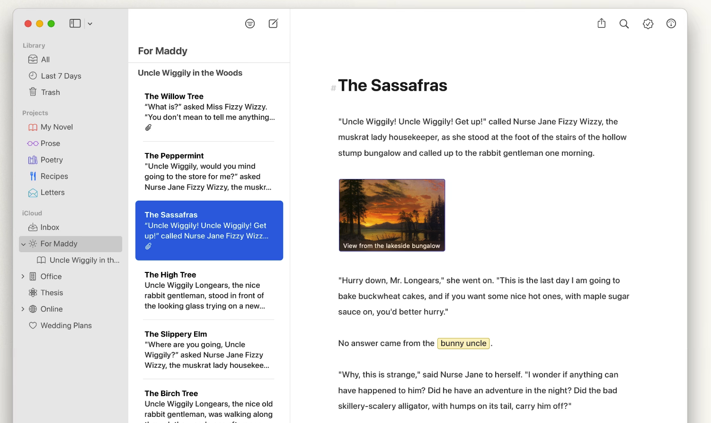
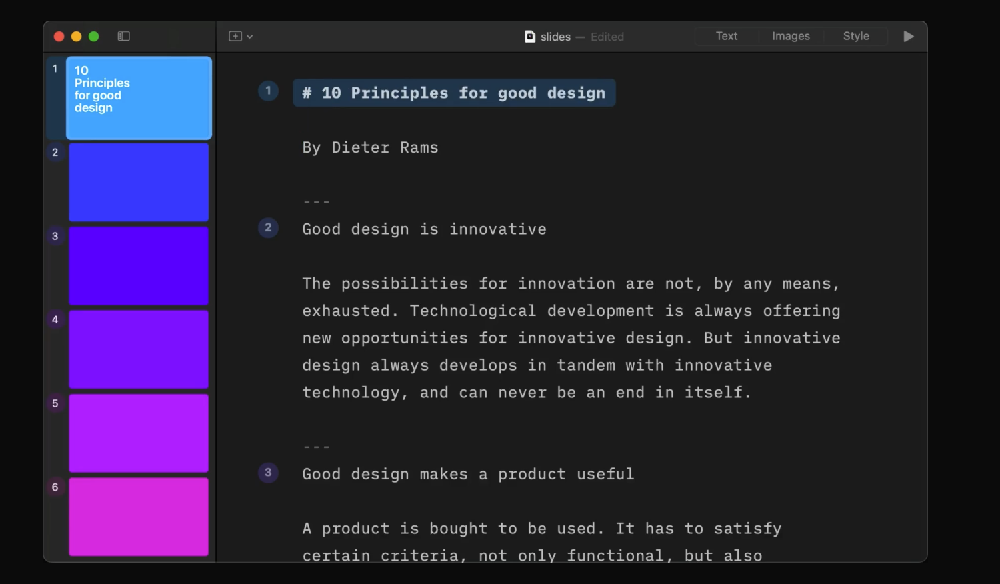

+++
date = '2024-03-30T20:37:53-05:00'
draft = false
title = 'The Power of Plain Text'
+++

I would venture to guess that most people, when they want to write something on their computer, default to one of two options:
1. Microsoft Word
2. Google Docs
If you’re on your phone, and you would like to write something, maybe you default to Apple Notes, or whatever the hell Google or Samsung is putting on their phones these days.
I’m here to tell you a better way.
That better way is *plain text*. 
## What is Plain Text?
One way of describing plain text is that it’s just the characters you type, with no formatting whatsoever. But plain text underpins every kind of document you write or interact with on your computer. HTML is, in a sense, ‘plain text’ that’s being interpreted by a web browser to hide certain text that’s not supposed to be shown, and use it as instructions on how to display the web page.
Even Microsoft Word documents are, in the background, just plain text with a bunch of stuff that Word hides when you open the document.
## Why is Plain Text Better?
So, you know when you’re writing something in Word or Google Docs, and you want to paste in some text from somewhere? By default, that text will take on the formatting from its source, which 99% of the time is not the formatting you have. If you actually care about the document you’re producing[^1], you’ll then change the formatting to match. Problem solved! Except not. 
You then try typing something in your document, and **goddammit**, it has the formatting from that thing I just pasted still! You change it back and then see it popping back up again somewhere else. And wait, why is the line spacing in my document all off all of a sudden? This is because there were hidden formatting characters that you pasted in that are influencing how your text is formatted. Because they’re hidden, it’s difficult to know how they’re influencing the text you write.
When you write in plain text, you see everything. And by default, when you paste text into a plain text editor, it will paste only the text, not the hidden formatting characters[^2]. So you have complete control over what’s going into your writing.
The other great thing about plain text is that it’s **universally readable**. Every single computing device ever made will let you open, read and edit a text file. Computers at the end of time will be able to read text files. You don’t have to worry that you’ve saved something in a format the other person won’t have. It may not be *pretty,* but it will be readable.
## Great, but What About Formatting?
You might bet the impression that I don’t think formatting is important. It is! Using **bold** words, headings, and other types of formatting are an essential part of writing good text. And I’m here to tell you that you **can** format in plain text, using a standard called “[Markdown.](https://daringfireball.net/projects/markdown/)”
Markdown is a way of writing in plain text where you can dictate your formatting by typing special characters into your text. Again, this is already possible with things like HTML, and if you know what you’re doing, you can just write HTML in a text document and have it render with formatting in a browser. But the magic of Markdown is that it’s both easy to understand and very readable in and of itself (unlike HTML.)
I won’t give a full guide here to Markdown, but the basics are simple. If you want to bold a word or phrase, you put two asterisks around it like so:
	I really want to **emphasize** this point!
If you wish to *italicize* something, just use one asterisk:
	This pizza is *very* tasty!
To do bullet points, just use a dash:
	- This is a point
	- This is another point
	- Yet another point
Want to make a heading? Use the “#” character for a heading, and add more than one for subheadings:
	# My Big Thought
	
	## Part One: Thinking
	
	This is part one of two, in which I...
You can hopefully see above that text you write in this way is readable on its own, but isn’t a replacement for properly formatted text that you want to share. 
Luckily, because Markdown is an open standard, there are a ton of apps that can take your Markdown writing and produce nicely formatted text. And because the formatting marks are shown, you always know exactly how your text will be formatted. I’m actually writing this post in one of those editors right now, called [Ulysses](https://ulysses.app). There are a ton more, and I’ll list out a few of my favourites below.

These apps often come with their own nice styles, and often let you customize the theme to get your text looking how you like it. And you can usually export into several different formats, including HTML, PDF, or even, God forbid, Microsoft Word.
## Going Further
I tend to default almost all of my writing to be in plain text for the reasons I stated above. And recently, I’ve even been experimenting with creating presentations in plain text. There is a class of applications that let you write a text document in Markdown, separating it into ‘slides’ using dashes, and even let you drop in images. Sure, you can’t make a super graphically intense presentation, but I love the appeal of just focusing on the words and the ideas, and letting something figure out the formatting after. It’s an area I want to explore more.

# List of Plain Text Apps
* I linked to Ulysses above. It’s a Markdown editor that focuses on writing and publishing. It’s available for Mac, iPad and iPhone, and syncs all of your work to all your devices using iCloud.
* [BBEdit](https://www.barebones.com/products/bbedit/) is a long-standing text editor for the Mac. Its features skew a little towards coders, but it’s super handy as a quick text editor, and has multiple powerful features, like advanced find and replace, line sorting, de-duplicating, etc. It’s like a little factory for plain text.
* [Bear](https://bear.app) is a great plain text / Markdown notes editor. It formats your text in Markdown as you type without hiding the characters, so you still know what’s happening. It also supports images, and even tables, while still keeping your notes highly exportable.
* [iA Writer](https://ia.net/writer) is a writing app like Ulysses, but a bit more basic. It’s great for just simple writing needs. 
* [iA Presenter](https://ia.net/presenter) is iA’s new presentation app (think PowerPoint or Google Slides) that is powered by plain text but produces beautiful, simple slides.

[^1]:	Whenever I see inconsistently formatted text in a document, it’s usually obvious that the author pasted stuff in and that they don’t give a shit about the quality of their work.

[^2]:	If nothing else, pasting text into a plain text editor *before* pasting into a word processor is a great way to “launder” your text to make it clean of hidden formatting marks.