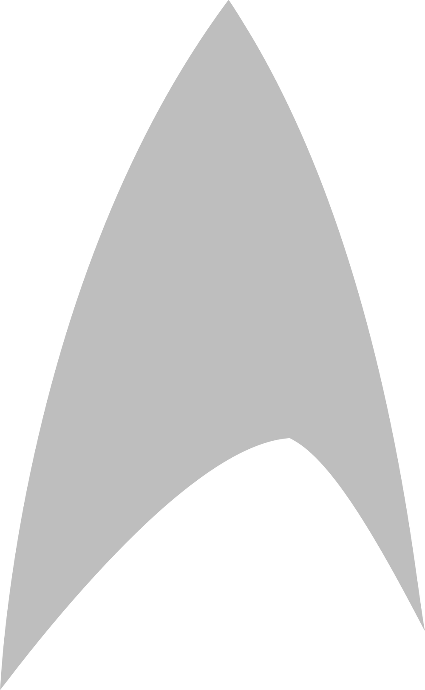

+++
date = '2025-01-15T12:50:01.409397-05:00'
draft = false
title = 'Testing Creating a Post from Obsidian'
+++

Hello, I am testing creating a post from Obsidian! I will now add an image to see where it goes. 

This is an update!

